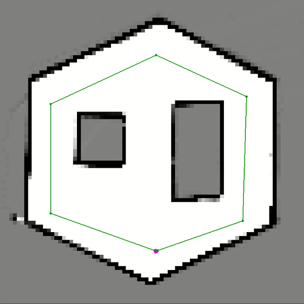
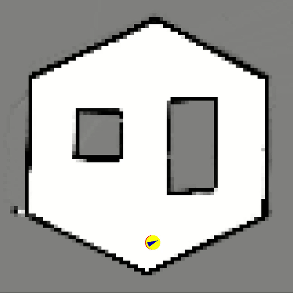
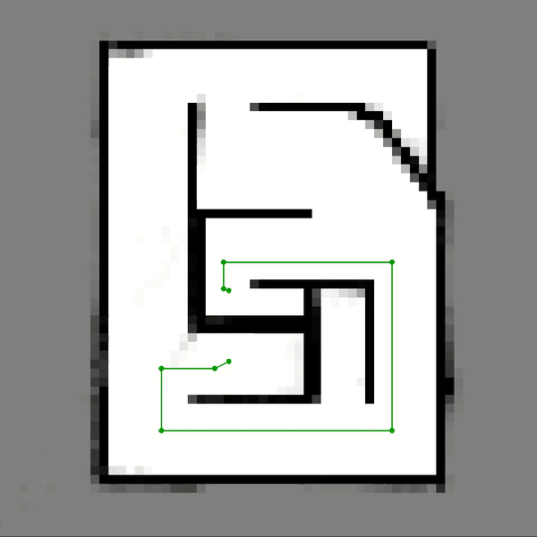
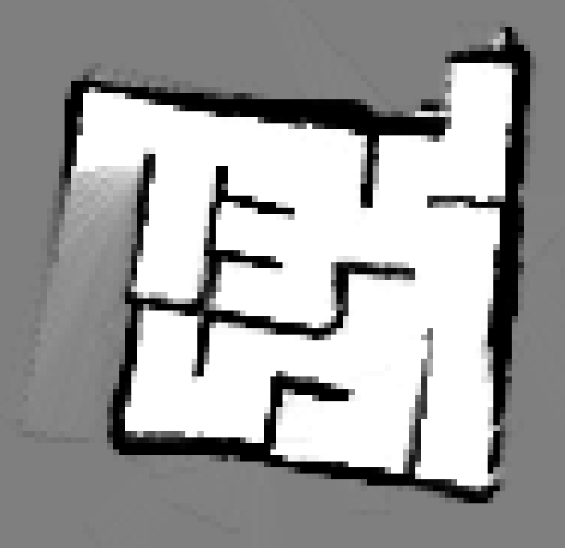

# SLAMbot
<sup>NOTE: the Robotic Systems Laboratory course refers to this robot as an Mbot, but I will refer to it as SLAMbot for the sake of clarity about its functionality.</sup>

The SLAMbot project is one of three projects I took part in for the Robotic Systems Laboratory course (ROB 550) at the University of Michigan. The goal was to use C++ program a LiDAR-equipped two-wheeled robot to map out and navigate a maze environment given no prior information. Due to the COVID-19 outbreak, the project moved from an in-person group project to an individual one done via simulation, so all implementation was done by me.


## Part 1: Simultaneous Localization & Mapping (SLAM)
The first part of the project involved the implementation of a SLAM system for the robot using a particle filter, which can be categorized into mapping, acting, and sensing functionality. **All modified files for this section can be found in ``/src/slam``**.

### *Mapping*
In ``mapping.cpp``, a discretized occupancy grid map in conjunction with an inverse sensor model is used to map out the surroundings. Operates under the assumption that location information is accurate.
- LiDAR scan is adjusted to compensate for movement using odometry reading
- Bresenham's line algorithm determines cells occupied by each LiDAR beam
  - Each cell score is initiated to ``0``
  - If beam passes through, cell is likely empty, so occupancy score is decreased
  - If beam ends, cell is likely occupied, so score is increased

<p align="center">
  
</p>
<p align="center">
  <sup><em>Mapping simulation. We feed the robot the true pose in this example,<br>
  which leads to an accurate mapping result</em></sup>
</p>

### *Acting*
In ``action_model.cpp``, the **sample_motion_model_odometry** algorithm from *Probabilistic Robotics* is used to model the imprecision of odometry readings and allow the propagation of the particles through the environment.
- Noise model is characterized by four alpha coefficients, which were tuned consistently to optimize performance
- Algorithm uses rotation-translation rotation and applies noise at each step

The initialization of the particle filter occurs in ``particle_filter.cpp`` and uses its own set of noise constants to create the point cloud at the beginning.

<p align="center">
  
</p>
<p align="center">
  <sup><em>Propagation of particle point cloud without sensor model/Bayesian filter.<br>
  Predictably, particles disperse and the map generated using odometry position is inaccurate</em></sup>
</p>

### *Sensing*
In ``sensor_model.cpp``, a simplified version of the **beam_range_finder_model** algorithm from *Probabilistic Robotics* is used to evaluate the weight of each particle and update the robot's understanding of its position after the action model has been applied.
- Each particle start with a log odds value of ``0.0``, and every beam (approximately 100) in the current LiDAR scan is used to increment its value
- If the end of the beam...
  - **Coincides** or nearly coincides with an occupied cell: we decrease log odds by very minimally
  - Falls **before** an obstacle: we decrement odds by a larger amount, penalizing its incorrectness, though not severely due to possible noise errors or missed obstacles in current map construction
  - Falls **after** an obstacle (and before max beam distance): we decrement even more, penalizing severely, since this indicates the robot is unlikely to be located at that particle's location
- We convert from log odds into a decimal and return it as output

In ``particle_filter.cpp``, these values are calculated, normalized for all particles, and assigned as weights. It determines the robot's position with a weighted average, and also resamples according to those weights with a low-variance resampler algorithm.

<p align="center">
  
</p>
<p align="center">
  <sup><em>Brown arrow represents odometry (same as from action model) and blue arrow<br>
  represents sensor model-corrected position, which is closer to true pose<br>
  and thus yields a coherent map</em></sup>
</p>

### *Complete SLAM*
With all parts now complete, we can test the full SLAM architecture in a maze, where we are given the odometry information and use it to find the SLAM pose and map our surroundings accordingly. 

<p align="center">
  
</p>
<p align="center">
  <sup><em>Full SLAM implementation used for maze exploration given path (8x speed).<br>
  Brown arrow represent odometry pose, blue arrow represents SLAM pose</em></sup>
</p>


## Part 2: Path Planning
The second part consisted of developing a path planning algorithm, which uses an A* search that incorporates an additional cost based on distance to the nearest obstacle. **All modified files for this section can be found in ``/src/planning``** .

### *Obstacle Distance Grid*
In ``obstacle_distance_grid.cpp``, a grid is constructed where each cell holds a value indicating its distance to the nearest obstacle.
- Reads into occupancy grid map; all positive occupancy scores are considered obstacles and treated accordingly
- First implementation used 4-directional distance, then moved to infinity norm, but I may continue to modify it to improve performance

### *A\* Search*
In its current state, ``a_star.cpp`` currently holds a 4-directional A\* search algorithm that allow the robot to move around its environment as it maps it out.
- **Cost:** 4-directional distance from the starting point
- **Heuristic:** 4-directional distance to goal with additional obstacle distance penalty if value from obstacle distance grid falls below threshold value; grows exponentially with decreasing distance

<p align="center">
  
</p>
<p align="center">
  <sup><em>A* path planning test</em></sup>
</p>

In ``exploration.cpp``, the A\* search is used to plan paths to "frontiers", which are a series of adjacent cells on the edge of unknown cells and known free cells that are accessible to the robot through known free space.


## Full Implementation  
While the code in its current state does not work perfectly, the complete system should operate as follows:
- Starting in unknown environment, scan surroundings in place and find nearest frontier using Euclidean distance
- Calculate midpoint of the frontier and use a breadth-first search to find closest free cell to it
- Plan path, then start moving along it
- When distance from path start is more than half of distance to goal, update list of frontiers using new map understanding and plan path to closest one - could be same one as before, or different
- Continue updating frontier list and path with same logic until target free cell is reached
- Find closest frontier and repeat
- When no frontiers remain, plan path and return to start point

<p align="center">
  
</p>
<p align="center">
  <sup><em>Maze map generated using simulated full implementation (Entire run duration<br>
  lasted 20+ minutes and didn't make sense to add here)</em></sup>
</p>

### *Issues to be fixed*
- 4-directional path/movement is slow and noisy, causing robot localization error to accumulate
- Localization error causes robot to get stuck on walls it thinks are farther away
- Unable to properly resolve final frontier, partically due to noisy mapping caused by poor localization

## Viewing .log Files
Included in this repository are .log files containing all of the LCM messages that were passed to the GUI, and can be viewed on your own. First, make sure you have the [LCM](https://github.com/lcm-proj/lcm) on your system. After downloading or cloning the repository, navigate to the ``slambot/`` folder in two separate terminals and do the following:

Terminal 1
```
$ make laptop-only
. setenv.sh
./bin/botgui
```
Terminal 2
```
$ . setenv.sh
lcm-logplayer-gui logs/<.LOG_FILE_NAME>
```

An animation similar to the ones shown above should play in the GUI.
  
